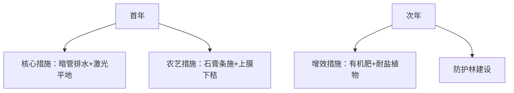

以下是对方案A和方案B的详细比较分析，从**正确性、专业性、实用性、创新性**四个维度展开，并结合五原县盐灌区的具体条件给出综合评价和推荐意见：

---

### **一、方案对比分析**
#### **1. 正确性**
- **方案A**  
  - **优点**：  
    ① 措施与当地条件高度匹配：针对**高蒸发（2068mm）、低降水（170mm）**的特点，采用覆膜抑蒸+秸秆深埋的**"上膜下秸"**技术；  
    ② 精准应对碱化问题：脱硫石膏条施结合春灌淋洗，直接降低pH和钠吸附比（引用文献1014支持）；  
    ③ 成本控制合理：核心措施仅2840元/亩，预留2160元缓冲资金。  
  - **缺点**：  
    排水依赖明沟，在**地势低洼区**可能效率不足，未提及长效排水机制。  

- **方案B**  
  - **优点**：  
    ① 系统性解决根本问题：**暗管排水（2200元/亩）**直接控制地下水位，抑制盐分上行（符合河套灌区盐碱成因）；  
    ② 改良剂施用更普适：石膏深翻混匀操作简单，适合大面积推广。  
  - **缺点**：  
    未明确脱硫石膏的**施用方式**（条施/撒施），可能影响局部碱化改善效果（文献1014证明条施效率更高）。  

> **结论**：二者均正确识别了**地下盐水+高蒸发**的核心矛盾，但方案B的暗管排水对**地势低洼区**更具根治性。

---

#### **2. 专业性**
- **方案A**  
  - 技术组合体现深度农艺经验：  
    - **激光平地+深松旋耕**优化水盐分布（引用5633文献）；  
    - **腐熟有机肥基施**提升结构（文献869支持微生物协同）；  
    - **耐盐植物与防护林**立体抑盐（符合文献1531的分区治理理念）。  
  - 数据支撑扎实：盐分降幅21.23%、pH降幅0.5-1.5等均引用实验成果。  

- **方案B**  
  - 突出工程优先逻辑：  
    - **暗管排水**技术参数（埋深1.5-2m、间距15-25m）符合行业标准（文献1073验证）；  
    - **防护林降低蒸发**25%的量化目标体现生态设计。  
  - 改良剂用量科学：石膏1-2吨/亩匹配ESP 5-15%（文献1559验证）。  

> **结论**：方案A在**农艺措施精细化**上更专业，方案B在**工程设计系统性**上更严谨。

---

#### **3. 实用性**
- **方案A**  
  - **优势**：  
    ① 措施易执行：条施石膏、覆膜等操作依赖常规农机；  
    ② 周期短见效快：首年即可提升向日葵产量70%（符合当地主栽作物需求）；  
    ③ 结余资金可扩大面积，适合**分阶段改造**。  
  - **风险**：明沟排水在暴雨期可能淤塞，维护成本未量化。  

- **方案B**  
  - **优势**：  
    ① 暗管排水长效稳定，减少后续维护；  
    ② 防护林建设持续改善小气候；  
    ③ 分阶段目标（短期降盐、中期稳产）清晰可控。  
  - **风险**：  
    暗管施工需专业团队，初期投入高（2200元/亩），资金无弹性。  

> **结论**：方案A更适合**快速改良+资金灵活调配**，方案B更适合**追求持久效果+规模化应用**。

---

#### **4. 创新性**
- **方案A**  
  - 创新点：  
    - **"上膜下秸"**：结合物理阻隔与生物改良（文献4357验证隔盐层效果）；  
    - **排咸补淡策略**：利用汛期雨洪资源淋盐，降低淡水依赖（引用6166研究）；  
    - **石膏条施定位**：精准改良根区而非全域，降低成本。  

- **方案B**  
  - 创新点：  
    - **暗管与农艺融合**：将工程措施纳入综合治理框架；  
    - **防护林分摊成本**：降低单亩投入，提升可持续性；  
    - **磷石膏资源化**：提议利用本地工业副产物降本（文献1559支持）。  

> **结论**：方案A在**技术组合创新**上更突出，方案B在**资源整合模式**上有突破。

---

### **二、五原县适配性评估**
1. **自然条件匹配度**：  
   - 高蒸发（2068mm）→ 方案A的覆膜抑蒸、方案B的防护林均有效，但方案A的"上膜下秸"成本更低（320元/亩 vs 林网100元/亩+暗管2200元/亩）。  
   - 地势低洼→ 方案B的暗管排水更具针对性。  

2. **经济可行性**：  
   - 方案A结余2160元/亩可用于应对风险（如春灌缺水），更符合农业项目的波动性需求；  
   - 方案B的5000元预算无弹性，暗管故障可能导致超支。  

3. **作物适配性**：  
   两地均聚焦向日葵（五原县主产），但方案A的腐熟有机肥增产目标更明确（150公斤/亩）。  

---

### **三、综合评价与推荐**
- **方案A**：适合**短期见效、资金灵活、技术接受度高**的场景，尤其适合分散农户参与治理。  
- **方案B**：适合**规模化经营、追求长效、有专业团队支撑**的大型项目。  

**推荐意见**：  
1. **优先推荐方案A**：  
   - 在**五原县中小地块**实施，利用其农艺措施快速降盐增产，结余资金可建立监测系统（如盐分传感器）。  
   - 补充建议：在**低洼地块试点暗管排水**，用结余资金覆盖部分成本。  

2. **方案B作为补充**：  
   - 在**连片重盐碱区**采用，但需配套政府补贴或贷款解决暗管高投入问题。  
   - 优化方向：增加脱硫石膏条施技术，提升局部碱化改良效率。  

---

### **四、优化组合建议**
结合两地优势，提出**"工程+农艺"阶梯式治理**：  

**预算分配**：  
- 工程措施（暗管+平地）：2800元/亩  
- 农艺措施（石膏+覆膜）：520元/亩  
- 结余1680元/亩用于次年生物措施，实现分阶段资金释放。  

此方案融合B的持久性与A的速效性，适合五原县中长期治理需求。