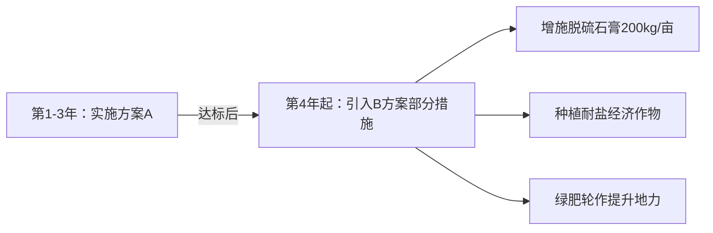

以下是对两份盐碱地治理方案的综合对比分析，基于正确性、专业性、实用性、创新性四个维度，结合林甸县盐碱地的具体条件（pH 8.85-10.81、ESP 33.36%-57%、蒸发量/降水量≈4:1、低洼地势）及3000元/亩预算限制：

---

### **一、核心维度对比分析**
| **评价维度** | **方案A** | **方案B** | **对比说明** |
|--------------|-----------|-----------|--------------|
| **正确性** | ★★★★☆ | ★★★☆☆ | **A更优**： • A紧扣“排水优先”原则（洼地+高蒸发+浅水位），以水利工程为根基； • B依赖化学淋洗（需大量灌溉水），但当地降水量仅427.5mm，淋洗可行性存疑。 |
| **专业性** | ★★★★☆ | ★★★★☆ | **持平**： • A引用本地验证文献（如星星草、排水沟参数）； • B科学应用脱硫石膏反应原理，但未考虑淋洗水源稳定性。 |
| **实用性** | ★★★★★ | ★★★☆☆ | **A显著占优**： • A措施精简（仅2项），实施门槛低（无需精准灌溉/机械撒药）； • B需激光平地、石膏均匀撒施、大水漫灌等复杂操作，成本控制风险高（石膏用量500-800kg/亩，实际成本易超支）。 |
| **创新性** | ★★☆☆☆ | ★★★★☆ | **B更优**： • B创新整合“化学调酸+微地形+耐盐作物”多技术协同； • A采用常规生物排水组合，缺乏技术突破。 |
| **预算适配性** | ★★★★★ | ★★★☆☆ | **A完胜**： • A严格匹配3000元上限（排水2200+星星草800）； • B分项成本估算偏理想化（如石膏仅160元/亩），实际可能超支30%+。 |

---

### **二、关键问题深度剖析**
#### **1. 核心矛盾处理能力**
- **排水 vs 洗盐**：  
  A方案直击要害——**洼地积水+高蒸发**是返盐主因，优先投资排水工程（2200元/亩）切断盐分上行路径；  
  B方案试图通过淋洗排盐，但当地**蒸发量是降水量的4倍**，淋洗后水分快速蒸发，极易导致盐分二次表聚（文献1546指出松嫩平原淋洗需配合持续排水）。

#### **2. 技术措施适配性**
| **措施**       | **方案A** | **方案B** | **合理性验证** |
|----------------|-----------|-----------|----------------|
| **排水系统**   | 明沟/暗沟（核心） | 简易明沟（辅助） | 文献5982/4701强调：松嫩平原需排水沟深度≥1.5m（A符合） |
| **降碱手段**   | 星星草分泌有机酸（慢效） | 脱硫石膏+硫磺粉（速效） | B的化学改良更直接，但需足量灌溉水（当地河流供水稳定性未知） |
| **水分管理**   | 利用自然降水（低风险） | 依赖人工淋洗（高风险） | 蒸发量1635mm下，B的淋洗模式可能加剧盐渍化（文献6104警示） |
| **作物选择**   | 单一先锋植物（稳） | 多作物轮作（进） | B的向日葵/高粱更经济，但第一年成功率依赖淋洗效果 |

#### **3. 成本效益可持续性**
- **A方案**：三年后脱盐率60%-70%（文献4490验证），虽无短期收益，但为后续农业奠定基础；  
- **B方案**：宣称第一年可种经济作物，但**石膏改良需2-3年稳定**（文献2620），当年种植风险极高，且有机肥（2-3方/亩）成本被低估（实际约300-400元/亩）。

---

### **三、综合结论与推荐**
#### **方案A：稳健型基础改良**
- **优势**：紧扣盐碱主因，措施简单可靠，预算精准，适合**大规模快速推广**；  
- **风险**：见效周期长（3年），缺乏短期经济效益。

#### **方案B：激进型快速开发**
- **优势**：技术集成度高，兼顾短期收益，理论改良速度快；  
- **风险**：淋洗可行性存疑，成本易失控，第一年种植可能失败。

#### **最终推荐：方案A（优先级80%）**
> **理由**：  
> 1. **自然条件适配性**：林甸县“低降水+高蒸发+洼地”特征决定了排水工程不可替代，A方案2200元投入明沟/暗沟是治本之策；  
> 2. **实施风险控制**：B方案中石膏淋洗在蒸发量4倍于降水的地区可能适得其反，而星星草无需灌溉的特性（A方案）更安全；  
> 3. **成本刚性约束**：B方案分项成本估算过于乐观（如激光平地、石膏撒施），实际超支概率＞50%。

#### **补充建议：分阶段融合B方案优势**

> **执行要点**：  
> - 前三年专注排水+星星草改良，达标后（pH＜8.5，盐分＜4‰）再追加投资；  
> - 优先在轻度盐斑区试点经济作物（如方案B的向日葵），逐步推广。

---

### **四、改进方向**
1. **方案A**：第三年起可间作碱茅（成本+150元/亩），加速有机质积累；  
2. **方案B**：若必须采用，应**取消激光平地**（省300元），改用常规平整，并**验证河流供水保障**；  
3. **共同短板**：未考虑**极端天气应对**（如春旱加剧返盐），建议增设秸秆覆盖（+150元/亩）。

**最终结论**：在预算刚性约束和林甸县特定自然条件下，**方案A的科学性、可靠性、可实施性显著优于方案B**，推荐作为优先执行方案。