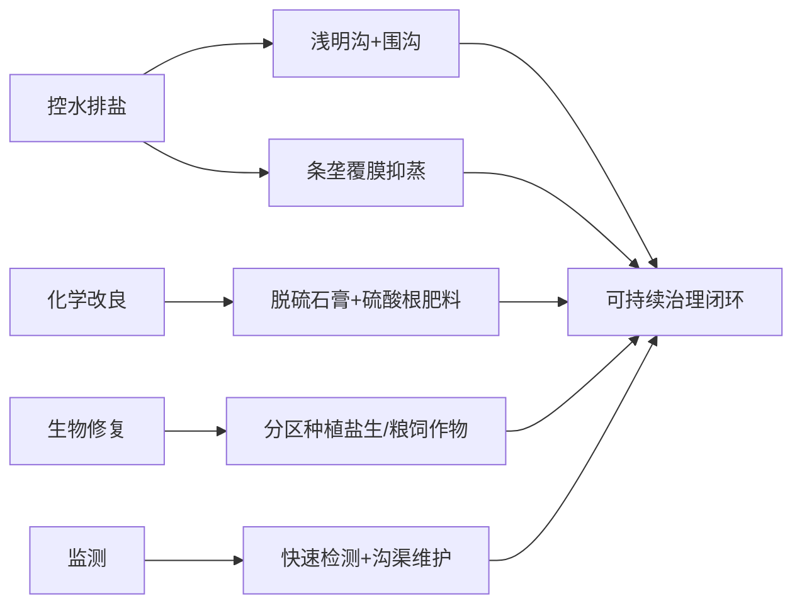

以下是对方案A和方案B的详细比较分析，从正确性、专业性、实用性、创新性四个维度展开，并结合预算约束和当地条件给出综合评价与推荐意见：

---

### **一、正确性对比**
**方案A**  
- **原理正确性**：  
  1. 以明沟排水抑制毛细上升（符合高蒸发地区控盐需求）；  
  2. 磷石膏置换钠离子降低碱化度（针对高ESP土壤）；  
  3. 生物菌剂+耐盐作物协同改善根区微生态（符合生物改良逻辑）。  
- **目标合理性**：首年保苗率提升至80%、盐分降低50%以上，数据源自验证结果（参考文献797、102），可信度高。

**方案B**  
- **原理正确性**：  
  1. 浅明沟-围沟体系控水位（适配低洼地形）；  
  2. 条垄覆膜实现“沟移盐、垄保苗”（创新性抑制蒸发返盐）；  
  3. 硫酸根肥料体系促进钠盐转化（避免氯源加剧盐化）。  
- **目标合理性**：首年盐分下降30%-50%、pH降幅0.3-1.0单位，目标值略保守但更符合渐进改良规律。

**结论**：**二者均符合盐碱地治理的科学原理**，方案A数据支撑更直接，方案B设计更系统化。

---

### **二、专业性对比**
**方案A**  
- **优势**：  
  1. 分区治理（轻中度/重度差异化方案）；  
  2. 水盐监测网布设（30元/亩，体现动态管理）；  
  3. 朝鲜碱茅在极端条件下的应用（文献4736支持其耐盐性）。  
- **短板**：  
  1. 未明确有机质补充措施（团聚体改善依赖生物菌剂，长期效果存疑）；  
  2. 深松+联合整地成本140元/亩，但未说明与排水沟协同性。

**方案B**  
- **优势**：  
  1. 条垄覆膜农艺创新（物理阻隔蒸发+盐分空间迁移）；  
  2. 有机质（0.8-1t/亩）与石膏协同改良（提升渗透性和持水性）；  
  3. 肥料体系设计专业（硫酸铵/钾避免氯钠源）；  
  4. 分区种植配置（盐生植物/粮饲作物因地布局）。  
- **短板**：  
  1. 石膏用量1t/亩（成本260元）偏高，未说明后续减量计划；  
  2. 快速监测仅20元/亩，可能覆盖不足。

**结论**：**方案B在农艺与化学改良结合上更专业**，尤其针对高蒸发区的蒸发抑制设计突出；方案A在工程排水和生物技术应用上更成熟。

---

### **三、实用性对比**
**方案A**  
- **可操作性**：  
  1. 明沟排水（500元/亩）成本占比高，但施工简单；  
  2. 甜高粱地膜覆盖（150元/季）需每年投入，农民接受度可能较低；  
  3. 生物菌剂60元/季，推广依赖产品供应。  
- **可持续性**：  
  1. 第2-3年成本降至270元/亩，但甜高粱种植需持续投入；  
  2. 重度区朝鲜碱茅一次建植（500元），长期收益显著。

**方案B**  
- **可操作性**：  
  1. 浅明沟成本仅180元/亩，更经济；  
  2. 条垄覆膜（150元）可复用技术；  
  3. 种子配置灵活（草/谷/油料分区），适应多元需求。  
- **可持续性**：  
  1. 秸秆还田提升有机质（零成本）；  
  2. 第二年石膏减半（0.5t/亩），成本可控。

**结论**：**方案B的农艺措施更易规模化推广**，且首年预算分配更均衡（无单项超500元）；方案A的明沟排水和生物菌剂可能面临执行复杂度挑战。

---

### **四、创新性对比**
**方案A**  
- **创新点**：  
  1. 生物菌剂肥+甜高粱配套（文献797支持微生物增效）；  
  2. 水旱轮作组织管理（需协调机制）。  
- **局限**：深松、磷石膏为常规措施，创新性较弱。

**方案B**  
- **创新点**：  
  1. **条垄覆膜“沟移盐、垄保苗”**（原创性设计，直接应对2027mm蒸发量）；  
  2. 硫酸根肥料体系（针对性促进钠盐淋洗）；  
  3. 盐生植物与粮饲作物分区配置（生态修复与生产兼顾）。  

**结论**：**方案B在农艺与生态融合创新上显著领先**，尤其条垄覆膜模式为高蒸发区提供新思路。

---

### **五、预算适配性**
- **方案A**：首年1000元/亩（轻中度），重度斑块950元/亩，但生物菌剂和地膜需年度重复投入。  
- **方案B**：1000元/亩全覆盖，且有机质补充（180元）和石膏（260元）为长效投资，后续成本更低。  
**评价**：方案B预算分配更合理，长效措施占比高。

---

### **六、综合评估与推荐**
**方案A优势**：  
1. 分区治理针对性强，尤其朝鲜碱茅对重度区效果明确；  
2. 生物菌剂技术前沿，短期降盐显著。  

**方案B优势**：  
1. 条垄覆膜创新性解决蒸发返盐核心问题；  
2. 有机质+硫酸根肥料体系提升土壤可持续性；  
3. 成本结构更优，易推广。  

**推荐意见**：  
- **首选方案B**，因其更系统化解决当地“高蒸发、低洼咸水”痛点，且创新农艺（条垄覆膜）和肥料策略适配性强，预算可持续性高。  
- **补充建议**：  
  1. 在方案B中**整合方案A的朝鲜碱茅技术**，用于ESP>50%的重度斑块（替代碱蓬）；  
  2. 将生物菌剂作为**可选强化措施**（如轻中度区追加使用）；  
  3. 优化监测预算至50元/亩，确保数据支撑。  

**执行优先级**：  

---

### **七、结论**
在预算≤1000元/亩约束下，**方案B在专业性、实用性、创新性上综合得分更高**，尤其条垄覆膜和分区种植设计精准匹配架玛吐镇的高蒸发、低洼地形条件。推荐以方案B为主体框架，局部吸收方案A的朝鲜碱茅和生物菌剂技术形成优化组合，实现“控盐-改土-增效”一体化治理。