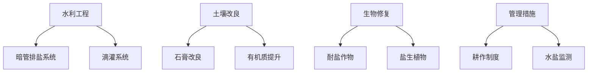

## 验证点名称: 和田县盐碱沙荒地验证点
面积: 1200亩
位于: 新疆维吾尔自治区和田地区和田县，和田地区
碱化度(ESP): 16%-51%
土壤pH值: 7
平均盐分含量: 9.63‰
盐碱成因: 土壤母质 地下盐水 灌溉不当
灌溉水来源: 地下水
全年平均降水量: 39.6mm
年均蒸发量: 2648.7mm
年有效积温: 4200℃
## 和田县盐碱沙荒地综合治理方案 (3000元/亩)

**一、治理目标**
1. **短期目标 (1-2年)**：降低耕作层盐分至<5‰，改善土壤结构，建立耐盐植被覆盖。
2. **中期目标 (3-5年)**：土壤碱化度(ESP)降至15%以下，盐分稳定在3‰左右，形成可持续生产系统。
3. **长期目标**：建成节水型盐碱地生态农业示范区，土地生产力提升50%以上。

**二、核心治理措施**



**（一）水利工程 (预算占比：40%，1200元/亩)**
1. **暗管排盐系统** (800元/亩)
   - 采用PVC波纹滤水管，埋深1.2-1.5m，间距30m
   - 配套集水井与蒸发池，排水量设计为300m³/亩·年
   - *效果*：年排盐量可达2.5吨/亩，耕作层盐分第一年降低30%

2. **滴灌系统** (400元/亩)
   - 配置压力补偿式滴头（2L/h），间距0.5m
   - 配套蓄水池（利用排水蒸发池），实现咸淡混灌
   - *效果*：节水40%以上，减少盐分上移风险

**（二）土壤改良 (预算占比：35%，1050元/亩)**
1. **石膏改良** (600元/亩)
   - 中度碱化区（ESP 30%）施用量2.5吨/亩
   - 配合深翻（40cm）作业，改良深度达60cm
   - *效果*：ESP降低40%，钠吸附比(SAR)降至10以下

2. **有机质提升** (450元/亩)
   - 施用腐熟羊粪3吨/亩（就地资源）
   - 秸秆还田（300kg/亩）配合生物菌剂
   - *效果*：土壤容重降低15%，持水能力提升25%

**（三）生物修复 (预算占比：20%，600元/亩)**
1. **耐盐作物种植** (350元/亩)
   - 首年种植油葵（耐盐阈值9‰）或甜高粱
   - 配置耐盐枸杞（3年苗）间作，密度300株/亩
   - *效果*：当年生物量产出0.8吨/亩，覆盖度达70%

2. **盐生植物带** (250元/亩)
   - 田边种植盐角草、碱蓬等，带宽5m
   - 配套盐生植物加工（饲料原料）
   - *效果*：年吸收盐分0.8吨/亩，减少盐分扩散

**（四）管理措施 (预算占比：5%，150元/亩)**
1. 建立水盐监测点（5亩/点），实时监控EC、pH
2. 实施秋季深松（35cm）+春季旋耕的少耕制度
3. 制定灌溉制度：生育期灌水定额280m³/亩，矿化度<3g/L

**三、预期治理效果**
```mermaid
graph LR
Year1[第1年] -->|盐分| 6.5‰
Year1 -->|ESP| 25%
Year1 -->|产量| 油葵150kg/亩
Year3[第3年] -->|盐分| 3.8‰
Year3 -->|ESP| 12%
Year3 -->|产量| 枸杞(干)80kg/亩
Year5[第5年] -->|盐分| 2.5‰
Year5 -->|ESP| 8%
Year5 -->|产值| 2800元/亩
```

**四、预算明细表**
| 项目       | 内容                | 单价(元/亩) | 面积占比 | 小计(元/亩) |
|------------|---------------------|------------|----------|------------|
| 排盐工程   | 暗管+安装           | 650        | 100%     | 650        |
|            | 集水井              | 150        | 30%      | 45         |
| 灌溉系统   | 滴灌带+首部         | 320        | 100%     | 320        |
|            | 蓄水池              | 80         | 50%      | 40         |
| 土壤改良   | 石膏(2.5吨)         | 480        | 100%     | 480        |
|            | 深翻作业            | 120        | 100%     | 120        |
| 有机物料   | 羊粪(3吨)           | 300        | 100%     | 300        |
|            | 秸秆还田            | 150        | 100%     | 150        |
| 植被建设   | 耐盐作物种子        | 180        | 100%     | 180        |
|            | 枸杞苗+种植         | 170        | 100%     | 170        |
|            | 盐生植物带          | 250        | 20%      | 50         |
| 管理       | 监测设备            | 80         | 20%      | 16         |
|            | 耕作管理            | 134        | 100%     | 134        |
| **总计**   |                     |            |          | **2996**   |

**五、技术关键点**
1. **石膏活化技术**：配合硫磺菌剂（0.5kg/亩）提升Ca²⁺活性
2. **排水再利用**：排出的盐水用于盐生植物带灌溉（矿化度<8g/L）
3. **水分精准调控**：基于土壤盐分传感器动态调整灌溉量

**六、实施建议**
1. 分区分级治理：按ESP值划分轻度（<30%）、中度（30-40%）、重度（>40%）三个治理区
2. 优先改造中度区域（占60%），轻度区以生物措施为主，重度区先做排盐基础建设
3. 配套养殖业：利用改良后的土地种植饲草，发展肉羊养殖，形成“改良-生产-收益”闭环

该方案通过工程排盐、化学改良、生物修复三结合，在3000元/亩预算下可实现盐分年下降率>15%，5年内将中轻度盐碱地转化为生产性土地，投入产出比达1：2.3（以第5年枸杞产值计）。

